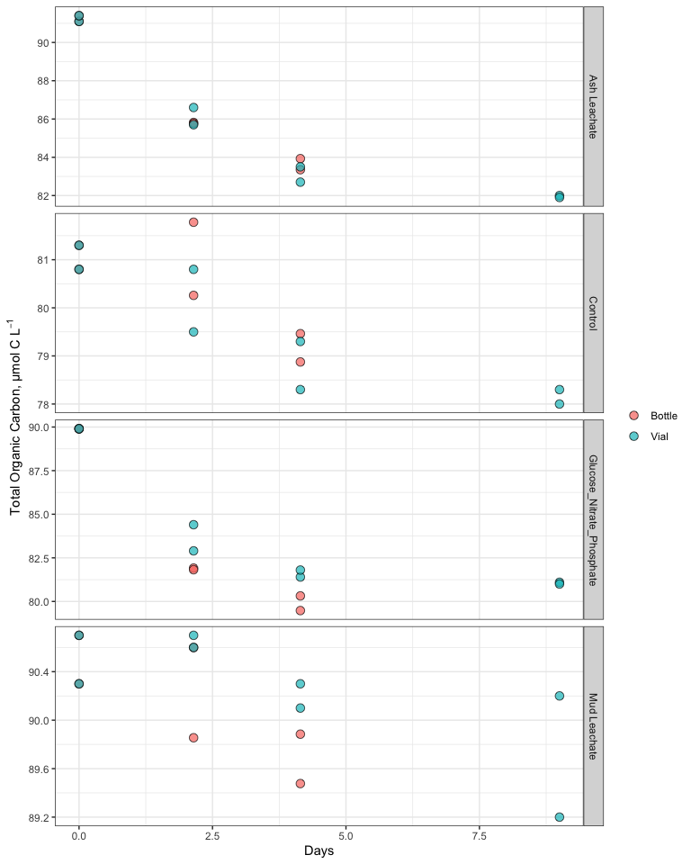
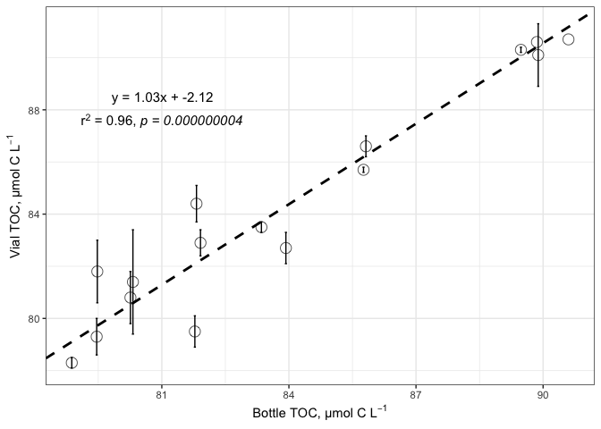
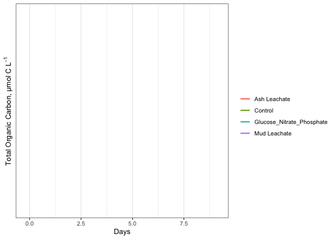
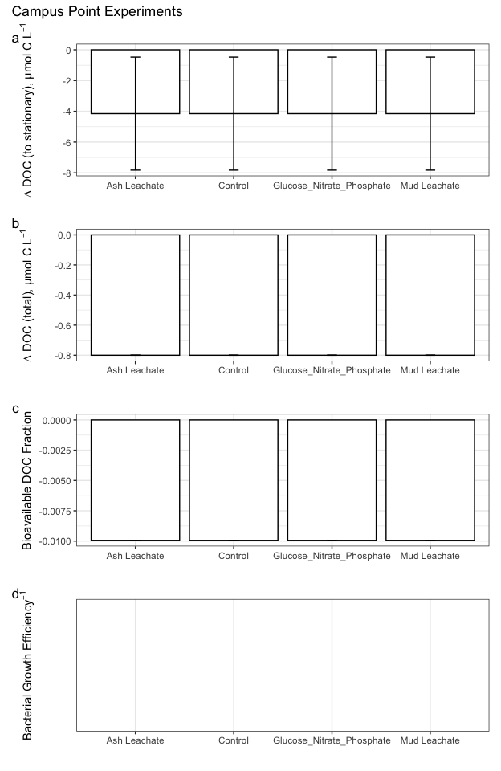

EEMB144L\_TOC
================
Tim Lamour
11/3/2020

\#Intro

This document shows how **individual bottle** TOC/DOC data from ACIDD
remineralization experiments were processed, QC’d, and analyzed

``` r
library(tidyverse)
```

    ## ── Attaching packages ──────────────────────────────────────────────────────────────────────────────────────────── tidyverse 1.3.0 ──

    ## ✓ ggplot2 3.3.2     ✓ purrr   0.3.4
    ## ✓ tibble  3.0.3     ✓ dplyr   1.0.2
    ## ✓ tidyr   1.1.2     ✓ stringr 1.4.0
    ## ✓ readr   1.3.1     ✓ forcats 0.5.0

    ## ── Conflicts ─────────────────────────────────────────────────────────────────────────────────────────────── tidyverse_conflicts() ──
    ## x dplyr::filter() masks stats::filter()
    ## x dplyr::lag()    masks stats::lag()

``` r
library(readxl)
library(lubridate)
```

    ## 
    ## Attaching package: 'lubridate'

    ## The following objects are masked from 'package:base':
    ## 
    ##     date, intersect, setdiff, union

# Import Data

``` r
excel_sheets("~/Desktop/Github/144l_students/Input_Data/week4/144L_2018_Exp_TOC.xlsx")
```

    ## [1] "Metadata" "Data"

``` r
metadata <- read_excel("~/Desktop/Github/144l_students/Input_Data/week4/144L_2018_Exp_TOC.xlsx", sheet = "Metadata")

data <- read_excel("~/Desktop/Github/144l_students/Input_Data/week4/144L_2018_Exp_TOC.xlsx", sheet = "Data")
```

``` r
glimpse(metadata)
```

    ## Rows: 80
    ## Columns: 16
    ## $ Experiment           <chr> "144L_2018", "144L_2018", "144L_2018", "144L_201…
    ## $ Location             <chr> "Campus Point", "Campus Point", "Campus Point", …
    ## $ Temperature          <dbl> 20, 20, 20, 20, 20, 20, 20, 20, 20, 20, 20, 20, …
    ## $ Depth                <dbl> 1, 1, 1, 1, 1, 1, 1, 1, 1, 1, 1, 1, 1, 1, 1, 1, …
    ## $ Bottle               <chr> "A", "A", "A", "A", "A", "A", "A", "A", "A", "A"…
    ## $ Timepoint            <dbl> 0, 1, 2, 3, 4, 5, 6, 7, 8, 9, 0, 1, 2, 3, 4, 5, …
    ## $ Treatment            <chr> "Control", "Control", "Control", "Control", "Con…
    ## $ Target_DOC_Amendment <dbl> 0, 0, 0, 0, 0, 0, 0, 0, 0, 0, 0, 0, 0, 0, 0, 0, …
    ## $ Inoculum_L           <dbl> 1.5, 1.5, 1.5, 1.5, 1.5, 1.5, 1.5, 1.5, 1.5, 1.5…
    ## $ Media_L              <dbl> 3.5, 3.5, 3.5, 3.5, 3.5, 3.5, 3.5, 3.5, 3.5, 3.5…
    ## $ Datetime             <chr> "2018-10-15T16:30", "2018-10-16T08:00", "2018-10…
    ## $ TOC_Sample           <lgl> TRUE, FALSE, FALSE, FALSE, TRUE, FALSE, FALSE, F…
    ## $ Parallel_Sample      <lgl> TRUE, FALSE, FALSE, FALSE, TRUE, FALSE, FALSE, F…
    ## $ Cell_Sample          <lgl> TRUE, TRUE, TRUE, TRUE, TRUE, TRUE, TRUE, TRUE, …
    ## $ DNA_Sample           <lgl> TRUE, FALSE, FALSE, FALSE, TRUE, FALSE, FALSE, F…
    ## $ DNA_SampleID         <chr> "144_A0_S6", NA, NA, NA, "144_A4_S7", NA, NA, NA…

``` r
glimpse(data)
```

    ## Rows: 32
    ## Columns: 6
    ## $ Bottle    <chr> "A", "A", "A", "A", "B", "B", "B", "B", "C", "C", "C", "C",…
    ## $ Timepoint <dbl> 0, 4, 8, 9, 0, 4, 8, 9, 0, 4, 8, 9, 0, 4, 8, 9, 0, 4, 8, 9,…
    ## $ TOC       <dbl> 81.30000, 81.77997, 78.87473, NA, 80.80000, 80.25890, 79.46…
    ## $ TOC_sd    <dbl> 0.40000000, NA, 0.38725049, NA, 0.20000000, 0.03069669, NA,…
    ## $ PTOC      <dbl> 81.3, 79.5, 78.3, 78.0, 80.8, 80.8, 79.3, 78.3, 91.1, 86.6,…
    ## $ PTOC_sd   <dbl> 0.4, 0.6, 0.2, 0.6, 0.2, 1.0, 0.7, 0.5, NA, 0.4, 0.6, 0.5, …

# Prepare data

``` r
joined <- left_join(metadata, data)
```

    ## Joining, by = c("Bottle", "Timepoint")

``` r
toc <- joined %>%
  mutate(Datetime = ymd_hm(Datetime)) %>%
  group_by(Experiment, Bottle, Treatment) %>% 
  mutate(interv = interval(first(Datetime), Datetime), hours = as.numeric(interv)/3600, days = hours/24) %>%
  ungroup() %>%
  select(Experiment:Datetime, hours, days, everything(), -c(contains("Sample")))

subset <- toc %>%
  select(Experiment, Bottle, Datetime, interv, hours, days)
```

``` r
glimpse(toc)
```

    ## Rows: 80
    ## Columns: 18
    ## $ Experiment           <chr> "144L_2018", "144L_2018", "144L_2018", "144L_201…
    ## $ Location             <chr> "Campus Point", "Campus Point", "Campus Point", …
    ## $ Temperature          <dbl> 20, 20, 20, 20, 20, 20, 20, 20, 20, 20, 20, 20, …
    ## $ Depth                <dbl> 1, 1, 1, 1, 1, 1, 1, 1, 1, 1, 1, 1, 1, 1, 1, 1, …
    ## $ Bottle               <chr> "A", "A", "A", "A", "A", "A", "A", "A", "A", "A"…
    ## $ Timepoint            <dbl> 0, 1, 2, 3, 4, 5, 6, 7, 8, 9, 0, 1, 2, 3, 4, 5, …
    ## $ Treatment            <chr> "Control", "Control", "Control", "Control", "Con…
    ## $ Target_DOC_Amendment <dbl> 0, 0, 0, 0, 0, 0, 0, 0, 0, 0, 0, 0, 0, 0, 0, 0, …
    ## $ Inoculum_L           <dbl> 1.5, 1.5, 1.5, 1.5, 1.5, 1.5, 1.5, 1.5, 1.5, 1.5…
    ## $ Media_L              <dbl> 3.5, 3.5, 3.5, 3.5, 3.5, 3.5, 3.5, 3.5, 3.5, 3.5…
    ## $ Datetime             <dttm> 2018-10-15 16:30:00, 2018-10-16 08:00:00, 2018-…
    ## $ hours                <dbl> 0.0, 15.5, 27.5, 39.5, 51.5, 63.5, 75.5, 87.5, 9…
    ## $ days                 <dbl> 0.0000000, 0.6458333, 1.1458333, 1.6458333, 2.14…
    ## $ TOC                  <dbl> 81.30000, NA, NA, NA, 81.77997, NA, NA, NA, 78.8…
    ## $ TOC_sd               <dbl> 0.40000000, NA, NA, NA, NA, NA, NA, NA, 0.387250…
    ## $ PTOC                 <dbl> 81.3, NA, NA, NA, 79.5, NA, NA, NA, 78.3, 78.0, …
    ## $ PTOC_sd              <dbl> 0.4, NA, NA, NA, 0.6, NA, NA, NA, 0.2, 0.6, 0.2,…
    ## $ interv               <Interval> 2018-10-15 16:30:00 UTC--2018-10-15 16:30:0…

# Plot the curves

## Pivot Data

``` r
pivot_toc <- toc %>%
  select(Experiment, Location, Bottle, Treatment, days, TOC, PTOC) %>%
  pivot_longer(TOC:PTOC, names_to = "sample", values_to = "value")

pivot_toc_sd <- toc %>%
  select(Experiment, Location, Bottle, Treatment, days, TOC_sd, PTOC_sd) %>% 
  pivot_longer(TOC_sd:PTOC_sd, names_to = "sample", names_prefix = "sd_", values_to = "sd")

pivoted <- left_join(pivot_toc, pivot_toc_sd) %>%
  mutate(sample = ifelse(sample == "TOC", "Bottle", "Vial"))
```

    ## Joining, by = c("Experiment", "Location", "Bottle", "Treatment", "days", "sample")

``` r
glimpse(pivoted)
```

    ## Rows: 160
    ## Columns: 8
    ## $ Experiment <chr> "144L_2018", "144L_2018", "144L_2018", "144L_2018", "144L_…
    ## $ Location   <chr> "Campus Point", "Campus Point", "Campus Point", "Campus Po…
    ## $ Bottle     <chr> "A", "A", "A", "A", "A", "A", "A", "A", "A", "A", "A", "A"…
    ## $ Treatment  <chr> "Control", "Control", "Control", "Control", "Control", "Co…
    ## $ days       <dbl> 0.0000000, 0.0000000, 0.6458333, 0.6458333, 1.1458333, 1.1…
    ## $ sample     <chr> "Bottle", "Vial", "Bottle", "Vial", "Bottle", "Vial", "Bot…
    ## $ value      <dbl> 81.30000, 81.30000, NA, NA, NA, NA, NA, NA, 81.77997, 79.5…
    ## $ sd         <dbl> NA, NA, NA, NA, NA, NA, NA, NA, NA, NA, NA, NA, NA, NA, NA…

## Plot

``` r
levels <- c("Control", "Ash Lechate", "Mud Lechate", "Glucose_Nitrate_Phosphate", "Campus Point", "Bottle", "Vial")

pivoted %>%
  filter(Location == "Campus Point") %>%
  drop_na(value) %>%
  ggplot(aes(x = days, y = value, group = interaction(Treatment, Bottle))) +
  geom_point(aes(fill = sample), size = 3, shape = 21, alpha = 0.7) +
  labs(x = "Days", y = expression("Total Organic Carbon, µmol C L"^-1), color = "", fill = "") + 
  theme_bw() + 
  facet_grid(rows = "Treatment", scales = "free") +
  guides(color = F)
```

<!-- -->

This graph shows the TOC concentrations in each of the treatments in
both bottles and vials. For the ash lechate, GNP, and control there is a
noticiable decrease in the concentration of TOC over time. However,
while the mud lechate also decreases over time it is not as tightly
correlated as the other treatments. Both bottles and vials produced
similar results, as shown by the regression analysis of each other.

The analytical detection limit for our TOC analysis is \~1.5 µmol C
L<sup>-1</sup>.

# TOC v PTOC (bottle v vial samples)

``` r
library(lmodel2)

reg.data <- toc %>%
  drop_na(TOC) %>%
  filter(Timepoint > 0)

reg <- lmodel2(PTOC ~ TOC, data = reg.data, nperm = 99)
```

    ## RMA was not requested: it will not be computed.

``` r
reg
```

    ## 
    ## Model II regression
    ## 
    ## Call: lmodel2(formula = PTOC ~ TOC, data = reg.data, nperm = 99)
    ## 
    ## n = 16   r = 0.9604998   r-square = 0.9225598 
    ## Parametric P-values:   2-tailed = 3.623619e-09    1-tailed = 1.811809e-09 
    ## Angle between the two OLS regression lines = 2.307491 degrees
    ## 
    ## Permutation tests of OLS, MA, RMA slopes: 1-tailed, tail corresponding to sign
    ## A permutation test of r is equivalent to a permutation test of the OLS slope
    ## P-perm for SMA = NA because the SMA slope cannot be tested
    ## 
    ## Regression results
    ##   Method Intercept     Slope Angle (degrees) P-perm (1-tailed)
    ## 1    OLS  1.291392 0.9890968        44.68594              0.01
    ## 2     MA -2.226082 1.0310159        45.87490              0.01
    ## 3    SMA -2.121795 1.0297731        45.84037                NA
    ## 
    ## Confidence intervals
    ##   Method 2.5%-Intercept 97.5%-Intercept 2.5%-Slope 97.5%-Slope
    ## 1    OLS      -12.50802        15.09081  0.8248319    1.153362
    ## 2     MA      -17.99796        11.05134  0.8727838    1.218975
    ## 3    SMA      -16.99788        10.56939  0.8785273    1.207057
    ## 
    ## Eigenvalues: 34.74849 0.6994871 
    ## 
    ## H statistic used for computing C.I. of MA: 0.006888855

``` r
intercept <- reg$regression.results[3, 2]
slope <- reg$regression.results[3, 3]

two_int <- reg$confidence.intervals[3, 2]
two_slope <- reg$confidence.intervals[3, 4]
nine_int <- reg$confidence.intervals[3, 3]
nine_slope <- reg$confidence.intervals[3, 5]
```

``` r
reg.data %>%
  ggplot(aes(x = TOC, y = PTOC)) +
  geom_errorbar(aes(ymin = PTOC - PTOC_sd, ymax = PTOC + PTOC_sd), width = 0.05) +
  geom_point(shape = 21, size = 4, alpha = 0.7) +
  geom_abline(intercept = intercept, slope = slope, color = "black", linetype = 2, size = 1) + 
  geom_abline(intercept = two_int, slope = two_slope, color = "black", linetype = 3, size = 1) +
  geom_abline(intercept = nine_int, slope = nine_slope, color = "black", linetype = 3, size = 1) +
  labs(x = expression("Bottle TOC, µmol C L"^-1), y = expression("Vial TOC, µmol C L"^-1)) + 
  theme_bw() +
  annotate(geom = "text", label = expression(atop("y = 1.03x + -2.12", paste("r"^2," = 0.96, ", italic(paste("p ", "= 0.000000004"))))), x = 81, y = 88, size = 4)
```

    ## Warning in is.na(x): is.na() applied to non-(list or vector) of type
    ## 'expression'

<!-- -->

This plot shows that the measurements in vials and bottle of TOC are
highly correlated to eachother and are not within the detection limit of
our research methods.

``` r
bc <- read_rds("~/Desktop/Github/144l_students/Input_Data/week1/output data/EEMB_144L_exp_processed_BacAbundance.rds") %>%
  select(-c(hours, days))

merge <- left_join(toc, bc) %>%
  select(Experiment:days, TOC:PTOC_sd, cells:diff_ln_cells, bc, ave_bc, sd_bc, everything(), -c(contains("Sample")) ) %>%
  group_by(Experiment, Treatment, Bottle) %>%
  fill(exp_start:sd_lag) %>%
  ungroup()
```

    ## Joining, by = c("Experiment", "Location", "Temperature", "Depth", "Bottle", "Timepoint", "Treatment", "Target_DOC_Amendment", "Inoculum_L", "Media_L", "Datetime")

``` r
glimpse(merge)
```

    ## Rows: 80
    ## Columns: 46
    ## $ Experiment           <chr> "144L_2018", "144L_2018", "144L_2018", "144L_201…
    ## $ Location             <chr> "Campus Point", "Campus Point", "Campus Point", …
    ## $ Temperature          <dbl> 20, 20, 20, 20, 20, 20, 20, 20, 20, 20, 20, 20, …
    ## $ Depth                <dbl> 1, 1, 1, 1, 1, 1, 1, 1, 1, 1, 1, 1, 1, 1, 1, 1, …
    ## $ Bottle               <chr> "A", "A", "A", "A", "A", "A", "A", "A", "A", "A"…
    ## $ Timepoint            <dbl> 0, 1, 2, 3, 4, 5, 6, 7, 8, 9, 0, 1, 2, 3, 4, 5, …
    ## $ Treatment            <chr> "Control", "Control", "Control", "Control", "Con…
    ## $ Target_DOC_Amendment <dbl> 0, 0, 0, 0, 0, 0, 0, 0, 0, 0, 0, 0, 0, 0, 0, 0, …
    ## $ Inoculum_L           <dbl> 1.5, 1.5, 1.5, 1.5, 1.5, 1.5, 1.5, 1.5, 1.5, 1.5…
    ## $ Media_L              <dbl> 3.5, 3.5, 3.5, 3.5, 3.5, 3.5, 3.5, 3.5, 3.5, 3.5…
    ## $ Datetime             <dttm> 2018-10-15 16:30:00, 2018-10-16 08:00:00, 2018-…
    ## $ hours                <dbl> 0.0, 15.5, 27.5, 39.5, 51.5, 63.5, 75.5, 87.5, 9…
    ## $ days                 <dbl> 0.0000000, 0.6458333, 1.1458333, 1.6458333, 2.14…
    ## $ TOC                  <dbl> 81.30000, NA, NA, NA, 81.77997, NA, NA, NA, 78.8…
    ## $ TOC_sd               <dbl> 0.40000000, NA, NA, NA, NA, NA, NA, NA, 0.387250…
    ## $ PTOC                 <dbl> 81.3, NA, NA, NA, 79.5, NA, NA, NA, 78.3, 78.0, …
    ## $ PTOC_sd              <dbl> 0.4, NA, NA, NA, 0.6, NA, NA, NA, 0.2, 0.6, 0.2,…
    ## $ cells                <dbl> 332531522, 523943125, 859019934, 906998856, 9330…
    ## $ ln_cells             <dbl> 19.62225, 20.07689, 20.57130, 20.62565, 20.65394…
    ## $ diff_ln_cells        <dbl> 0.000000000, 0.454648479, 0.494408990, 0.0543490…
    ## $ bc                   <dbl> 0.8313288, 1.3098578, 2.1475498, 2.2674971, 2.33…
    ## $ ave_bc               <dbl> 0.9022187, 1.3301541, 1.9535757, 2.3515191, 2.54…
    ## $ sd_bc                <dbl> 0.10025342, 0.02870334, 0.27432087, 0.11882499, …
    ## $ interv               <Interval> 2018-10-15 16:30:00 UTC--2018-10-15 16:30:0…
    ## $ exp_start            <dbl> 0, 0, 0, 0, 0, 0, 0, 0, 0, 0, 0, 0, 0, 0, 0, 0, …
    ## $ exp_end              <dbl> 1, 1, 1, 1, 1, 1, 1, 1, 1, 1, 1, 1, 1, 1, 1, 1, …
    ## $ ln_cells_exp_start   <dbl> 19.62225, 19.62225, 19.62225, 19.62225, 19.62225…
    ## $ ln_cells_exp_end     <dbl> 20.07689, 20.07689, 20.07689, 20.07689, 20.07689…
    ## $ cells_exp_start      <dbl> 332531522, 332531522, 332531522, 332531522, 3325…
    ## $ cells_exp_end        <dbl> 523943125, 523943125, 523943125, 523943125, 5239…
    ## $ days_exp_start       <dbl> 0, 0, 0, 0, 0, 0, 0, 0, 0, 0, 0, 0, 0, 0, 0, 0, …
    ## $ days_exp_end         <dbl> 0.6458333, 0.6458333, 0.6458333, 0.6458333, 0.64…
    ## $ mew                  <dbl> 0.7039718, 0.7039718, 0.7039718, 0.7039718, 0.70…
    ## $ doubling             <dbl> 0.9846235, 0.9846235, 0.9846235, 0.9846235, 0.98…
    ## $ delta_cells          <dbl> 191411603, 191411603, 191411603, 191411603, 1914…
    ## $ delta_bc             <dbl> 0.4785290, 0.4785290, 0.4785290, 0.4785290, 0.47…
    ## $ ave_mew              <dbl> 0.6056875, 0.6056875, 0.6056875, 0.6056875, 0.60…
    ## $ sd_mew               <dbl> 0.10113376, 0.10113376, 0.10113376, 0.10113376, …
    ## $ ave_doubling         <dbl> 1.1753457, 1.1753457, 1.1753457, 1.1753457, 1.17…
    ## $ sd_doubling          <dbl> 0.196251588, 0.196251588, 0.196251588, 0.1962515…
    ## $ ave_delta_cells      <dbl> 171174186, 171174186, 171174186, 171174186, 1711…
    ## $ sd_delta_cells       <dbl> 20824130, 20824130, 20824130, 20824130, 20824130…
    ## $ ave_delta_bc         <dbl> 0.4279355, 0.4279355, 0.4279355, 0.4279355, 0.42…
    ## $ sd_delta_bc          <dbl> 0.05206033, 0.05206033, 0.05206033, 0.05206033, …
    ## $ ave_lag              <dbl> 0, 0, 0, 0, 0, 0, 0, 0, 0, 0, 0, 0, 0, 0, 0, 0, …
    ## $ sd_lag               <dbl> 0, 0, 0, 0, 0, 0, 0, 0, 0, 0, 0, 0, 0, 0, 0, 0, …

``` r
glimpse(merge)
```

    ## Rows: 80
    ## Columns: 46
    ## $ Experiment           <chr> "144L_2018", "144L_2018", "144L_2018", "144L_201…
    ## $ Location             <chr> "Campus Point", "Campus Point", "Campus Point", …
    ## $ Temperature          <dbl> 20, 20, 20, 20, 20, 20, 20, 20, 20, 20, 20, 20, …
    ## $ Depth                <dbl> 1, 1, 1, 1, 1, 1, 1, 1, 1, 1, 1, 1, 1, 1, 1, 1, …
    ## $ Bottle               <chr> "A", "A", "A", "A", "A", "A", "A", "A", "A", "A"…
    ## $ Timepoint            <dbl> 0, 1, 2, 3, 4, 5, 6, 7, 8, 9, 0, 1, 2, 3, 4, 5, …
    ## $ Treatment            <chr> "Control", "Control", "Control", "Control", "Con…
    ## $ Target_DOC_Amendment <dbl> 0, 0, 0, 0, 0, 0, 0, 0, 0, 0, 0, 0, 0, 0, 0, 0, …
    ## $ Inoculum_L           <dbl> 1.5, 1.5, 1.5, 1.5, 1.5, 1.5, 1.5, 1.5, 1.5, 1.5…
    ## $ Media_L              <dbl> 3.5, 3.5, 3.5, 3.5, 3.5, 3.5, 3.5, 3.5, 3.5, 3.5…
    ## $ Datetime             <dttm> 2018-10-15 16:30:00, 2018-10-16 08:00:00, 2018-…
    ## $ hours                <dbl> 0.0, 15.5, 27.5, 39.5, 51.5, 63.5, 75.5, 87.5, 9…
    ## $ days                 <dbl> 0.0000000, 0.6458333, 1.1458333, 1.6458333, 2.14…
    ## $ TOC                  <dbl> 81.30000, NA, NA, NA, 81.77997, NA, NA, NA, 78.8…
    ## $ TOC_sd               <dbl> 0.40000000, NA, NA, NA, NA, NA, NA, NA, 0.387250…
    ## $ PTOC                 <dbl> 81.3, NA, NA, NA, 79.5, NA, NA, NA, 78.3, 78.0, …
    ## $ PTOC_sd              <dbl> 0.4, NA, NA, NA, 0.6, NA, NA, NA, 0.2, 0.6, 0.2,…
    ## $ cells                <dbl> 332531522, 523943125, 859019934, 906998856, 9330…
    ## $ ln_cells             <dbl> 19.62225, 20.07689, 20.57130, 20.62565, 20.65394…
    ## $ diff_ln_cells        <dbl> 0.000000000, 0.454648479, 0.494408990, 0.0543490…
    ## $ bc                   <dbl> 0.8313288, 1.3098578, 2.1475498, 2.2674971, 2.33…
    ## $ ave_bc               <dbl> 0.9022187, 1.3301541, 1.9535757, 2.3515191, 2.54…
    ## $ sd_bc                <dbl> 0.10025342, 0.02870334, 0.27432087, 0.11882499, …
    ## $ interv               <Interval> 2018-10-15 16:30:00 UTC--2018-10-15 16:30:0…
    ## $ exp_start            <dbl> 0, 0, 0, 0, 0, 0, 0, 0, 0, 0, 0, 0, 0, 0, 0, 0, …
    ## $ exp_end              <dbl> 1, 1, 1, 1, 1, 1, 1, 1, 1, 1, 1, 1, 1, 1, 1, 1, …
    ## $ ln_cells_exp_start   <dbl> 19.62225, 19.62225, 19.62225, 19.62225, 19.62225…
    ## $ ln_cells_exp_end     <dbl> 20.07689, 20.07689, 20.07689, 20.07689, 20.07689…
    ## $ cells_exp_start      <dbl> 332531522, 332531522, 332531522, 332531522, 3325…
    ## $ cells_exp_end        <dbl> 523943125, 523943125, 523943125, 523943125, 5239…
    ## $ days_exp_start       <dbl> 0, 0, 0, 0, 0, 0, 0, 0, 0, 0, 0, 0, 0, 0, 0, 0, …
    ## $ days_exp_end         <dbl> 0.6458333, 0.6458333, 0.6458333, 0.6458333, 0.64…
    ## $ mew                  <dbl> 0.7039718, 0.7039718, 0.7039718, 0.7039718, 0.70…
    ## $ doubling             <dbl> 0.9846235, 0.9846235, 0.9846235, 0.9846235, 0.98…
    ## $ delta_cells          <dbl> 191411603, 191411603, 191411603, 191411603, 1914…
    ## $ delta_bc             <dbl> 0.4785290, 0.4785290, 0.4785290, 0.4785290, 0.47…
    ## $ ave_mew              <dbl> 0.6056875, 0.6056875, 0.6056875, 0.6056875, 0.60…
    ## $ sd_mew               <dbl> 0.10113376, 0.10113376, 0.10113376, 0.10113376, …
    ## $ ave_doubling         <dbl> 1.1753457, 1.1753457, 1.1753457, 1.1753457, 1.17…
    ## $ sd_doubling          <dbl> 0.196251588, 0.196251588, 0.196251588, 0.1962515…
    ## $ ave_delta_cells      <dbl> 171174186, 171174186, 171174186, 171174186, 1711…
    ## $ sd_delta_cells       <dbl> 20824130, 20824130, 20824130, 20824130, 20824130…
    ## $ ave_delta_bc         <dbl> 0.4279355, 0.4279355, 0.4279355, 0.4279355, 0.42…
    ## $ sd_delta_bc          <dbl> 0.05206033, 0.05206033, 0.05206033, 0.05206033, …
    ## $ ave_lag              <dbl> 0, 0, 0, 0, 0, 0, 0, 0, 0, 0, 0, 0, 0, 0, 0, 0, …
    ## $ sd_lag               <dbl> 0, 0, 0, 0, 0, 0, 0, 0, 0, 0, 0, 0, 0, 0, 0, 0, …

``` r
subset <- merge %>%
  select(Experiment, Treatment, Bottle, days, PTOC, bc)
```

# Interpolate

``` r
library(zoo)
```

    ## 
    ## Attaching package: 'zoo'

    ## The following objects are masked from 'package:base':
    ## 
    ##     as.Date, as.Date.numeric

We only want to interpolate within an experiment and not across
experiments, so we’ll perform the interpolation by using the
split-apply-combine strategy.

  - split the dataframe into a list of its elements (experiments and
    bottles)
  - apply the interpolation function to each of the list elements
  - combine the results into a new dataframe

## split

``` r
to_interpolate <- merge %>%
  select(Experiment, Bottle, Timepoint, days, PTOC, bc) %>%
  group_by(Experiment, Bottle)

list <- to_interpolate %>%
  group_split()

keys <- to_interpolate %>%
  group_keys() %>%
  mutate(key = paste(Experiment, Bottle))

names(list) <- keys$key
```

## Write the function

``` r
interp.func <- function(x) {
  y <- zoo(x, order.by = x$days)
  interp_toc <- round(as.numeric(na.approx(y$PTOC, na.rm = F)), 1)
  interp_bc <- round(as.numeric(na.approx(y$bc, na.rm = F)), 1)
  z <- cbind(y, interp_toc, interp_bc)
  as.tibble(z)
}
```

``` r
library(plyr)
```

    ## ------------------------------------------------------------------------------

    ## You have loaded plyr after dplyr - this is likely to cause problems.
    ## If you need functions from both plyr and dplyr, please load plyr first, then dplyr:
    ## library(plyr); library(dplyr)

    ## ------------------------------------------------------------------------------

    ## 
    ## Attaching package: 'plyr'

    ## The following objects are masked from 'package:dplyr':
    ## 
    ##     arrange, count, desc, failwith, id, mutate, rename, summarise,
    ##     summarize

    ## The following object is masked from 'package:purrr':
    ## 
    ##     compact

## Apply and combine

``` r
interpolated <- lapply(list, interp.func) %>%
  plyr::ldply(., as.data.frame) %>%
  select(-c(.id, PTOC, bc, days)) %>%
  mutate_at(vars(Timepoint:interp_bc), as.numeric) %>%
  left_join(merge, .)
```

    ## Warning: `as.tibble()` is deprecated as of tibble 2.0.0.
    ## Please use `as_tibble()` instead.
    ## The signature and semantics have changed, see `?as_tibble`.
    ## This warning is displayed once every 8 hours.
    ## Call `lifecycle::last_warnings()` to see where this warning was generated.

    ## Joining, by = c("Experiment", "Bottle", "Timepoint")

``` r
glimpse(interpolated)
```

    ## Rows: 80
    ## Columns: 48
    ## $ Experiment           <chr> "144L_2018", "144L_2018", "144L_2018", "144L_201…
    ## $ Location             <chr> "Campus Point", "Campus Point", "Campus Point", …
    ## $ Temperature          <dbl> 20, 20, 20, 20, 20, 20, 20, 20, 20, 20, 20, 20, …
    ## $ Depth                <dbl> 1, 1, 1, 1, 1, 1, 1, 1, 1, 1, 1, 1, 1, 1, 1, 1, …
    ## $ Bottle               <chr> "A", "A", "A", "A", "A", "A", "A", "A", "A", "A"…
    ## $ Timepoint            <dbl> 0, 1, 2, 3, 4, 5, 6, 7, 8, 9, 0, 1, 2, 3, 4, 5, …
    ## $ Treatment            <chr> "Control", "Control", "Control", "Control", "Con…
    ## $ Target_DOC_Amendment <dbl> 0, 0, 0, 0, 0, 0, 0, 0, 0, 0, 0, 0, 0, 0, 0, 0, …
    ## $ Inoculum_L           <dbl> 1.5, 1.5, 1.5, 1.5, 1.5, 1.5, 1.5, 1.5, 1.5, 1.5…
    ## $ Media_L              <dbl> 3.5, 3.5, 3.5, 3.5, 3.5, 3.5, 3.5, 3.5, 3.5, 3.5…
    ## $ Datetime             <dttm> 2018-10-15 16:30:00, 2018-10-16 08:00:00, 2018-…
    ## $ hours                <dbl> 0.0, 15.5, 27.5, 39.5, 51.5, 63.5, 75.5, 87.5, 9…
    ## $ days                 <dbl> 0.0000000, 0.6458333, 1.1458333, 1.6458333, 2.14…
    ## $ TOC                  <dbl> 81.30000, NA, NA, NA, 81.77997, NA, NA, NA, 78.8…
    ## $ TOC_sd               <dbl> 0.40000000, NA, NA, NA, NA, NA, NA, NA, 0.387250…
    ## $ PTOC                 <dbl> 81.3, NA, NA, NA, 79.5, NA, NA, NA, 78.3, 78.0, …
    ## $ PTOC_sd              <dbl> 0.4, NA, NA, NA, 0.6, NA, NA, NA, 0.2, 0.6, 0.2,…
    ## $ cells                <dbl> 332531522, 523943125, 859019934, 906998856, 9330…
    ## $ ln_cells             <dbl> 19.62225, 20.07689, 20.57130, 20.62565, 20.65394…
    ## $ diff_ln_cells        <dbl> 0.000000000, 0.454648479, 0.494408990, 0.0543490…
    ## $ bc                   <dbl> 0.8313288, 1.3098578, 2.1475498, 2.2674971, 2.33…
    ## $ ave_bc               <dbl> 0.9022187, 1.3301541, 1.9535757, 2.3515191, 2.54…
    ## $ sd_bc                <dbl> 0.10025342, 0.02870334, 0.27432087, 0.11882499, …
    ## $ interv               <Interval> 2018-10-15 16:30:00 UTC--2018-10-15 16:30:0…
    ## $ exp_start            <dbl> 0, 0, 0, 0, 0, 0, 0, 0, 0, 0, 0, 0, 0, 0, 0, 0, …
    ## $ exp_end              <dbl> 1, 1, 1, 1, 1, 1, 1, 1, 1, 1, 1, 1, 1, 1, 1, 1, …
    ## $ ln_cells_exp_start   <dbl> 19.62225, 19.62225, 19.62225, 19.62225, 19.62225…
    ## $ ln_cells_exp_end     <dbl> 20.07689, 20.07689, 20.07689, 20.07689, 20.07689…
    ## $ cells_exp_start      <dbl> 332531522, 332531522, 332531522, 332531522, 3325…
    ## $ cells_exp_end        <dbl> 523943125, 523943125, 523943125, 523943125, 5239…
    ## $ days_exp_start       <dbl> 0, 0, 0, 0, 0, 0, 0, 0, 0, 0, 0, 0, 0, 0, 0, 0, …
    ## $ days_exp_end         <dbl> 0.6458333, 0.6458333, 0.6458333, 0.6458333, 0.64…
    ## $ mew                  <dbl> 0.7039718, 0.7039718, 0.7039718, 0.7039718, 0.70…
    ## $ doubling             <dbl> 0.9846235, 0.9846235, 0.9846235, 0.9846235, 0.98…
    ## $ delta_cells          <dbl> 191411603, 191411603, 191411603, 191411603, 1914…
    ## $ delta_bc             <dbl> 0.4785290, 0.4785290, 0.4785290, 0.4785290, 0.47…
    ## $ ave_mew              <dbl> 0.6056875, 0.6056875, 0.6056875, 0.6056875, 0.60…
    ## $ sd_mew               <dbl> 0.10113376, 0.10113376, 0.10113376, 0.10113376, …
    ## $ ave_doubling         <dbl> 1.1753457, 1.1753457, 1.1753457, 1.1753457, 1.17…
    ## $ sd_doubling          <dbl> 0.196251588, 0.196251588, 0.196251588, 0.1962515…
    ## $ ave_delta_cells      <dbl> 171174186, 171174186, 171174186, 171174186, 1711…
    ## $ sd_delta_cells       <dbl> 20824130, 20824130, 20824130, 20824130, 20824130…
    ## $ ave_delta_bc         <dbl> 0.4279355, 0.4279355, 0.4279355, 0.4279355, 0.42…
    ## $ sd_delta_bc          <dbl> 0.05206033, 0.05206033, 0.05206033, 0.05206033, …
    ## $ ave_lag              <dbl> 0, 0, 0, 0, 0, 0, 0, 0, 0, 0, 0, 0, 0, 0, 0, 0, …
    ## $ sd_lag               <dbl> 0, 0, 0, 0, 0, 0, 0, 0, 0, 0, 0, 0, 0, 0, 0, 0, …
    ## $ interp_toc           <dbl> 81.3, 80.8, 80.3, 79.9, 79.5, 79.2, 78.9, 78.6, …
    ## $ interp_bc            <dbl> 0.8, 1.3, 2.1, 2.3, 2.3, 2.2, 2.0, 2.0, 2.4, NA,…

# Estimate DOC, Bioavailability, BGEs

``` r
doc <- interpolated %>%
  mutate(doc = interp_toc - interp_bc) %>% 
  group_by(Experiment, Bottle) %>%
  mutate(bioav_doc = (first(doc) - last(na.omit(doc))) / first(doc), 
         doc_exp_end = ifelse(Timepoint == exp_end, doc, NA), 
         delta_doc = first(doc) - doc_exp_end,
         tdelta_doc = first(doc) - last(na.omit(doc)),
         bge = ifelse(delta_doc > 1.5, delta_bc/delta_doc, NA)) %>%
  fill(doc_exp_end:bge, .direction = "downup") %>%
  ungroup()


glimpse(doc)
```

    ## Rows: 80
    ## Columns: 54
    ## $ Experiment           <chr> "144L_2018", "144L_2018", "144L_2018", "144L_201…
    ## $ Location             <chr> "Campus Point", "Campus Point", "Campus Point", …
    ## $ Temperature          <dbl> 20, 20, 20, 20, 20, 20, 20, 20, 20, 20, 20, 20, …
    ## $ Depth                <dbl> 1, 1, 1, 1, 1, 1, 1, 1, 1, 1, 1, 1, 1, 1, 1, 1, …
    ## $ Bottle               <chr> "A", "A", "A", "A", "A", "A", "A", "A", "A", "A"…
    ## $ Timepoint            <dbl> 0, 1, 2, 3, 4, 5, 6, 7, 8, 9, 0, 1, 2, 3, 4, 5, …
    ## $ Treatment            <chr> "Control", "Control", "Control", "Control", "Con…
    ## $ Target_DOC_Amendment <dbl> 0, 0, 0, 0, 0, 0, 0, 0, 0, 0, 0, 0, 0, 0, 0, 0, …
    ## $ Inoculum_L           <dbl> 1.5, 1.5, 1.5, 1.5, 1.5, 1.5, 1.5, 1.5, 1.5, 1.5…
    ## $ Media_L              <dbl> 3.5, 3.5, 3.5, 3.5, 3.5, 3.5, 3.5, 3.5, 3.5, 3.5…
    ## $ Datetime             <dttm> 2018-10-15 16:30:00, 2018-10-16 08:00:00, 2018-…
    ## $ hours                <dbl> 0.0, 15.5, 27.5, 39.5, 51.5, 63.5, 75.5, 87.5, 9…
    ## $ days                 <dbl> 0.0000000, 0.6458333, 1.1458333, 1.6458333, 2.14…
    ## $ TOC                  <dbl> 81.30000, NA, NA, NA, 81.77997, NA, NA, NA, 78.8…
    ## $ TOC_sd               <dbl> 0.40000000, NA, NA, NA, NA, NA, NA, NA, 0.387250…
    ## $ PTOC                 <dbl> 81.3, NA, NA, NA, 79.5, NA, NA, NA, 78.3, 78.0, …
    ## $ PTOC_sd              <dbl> 0.4, NA, NA, NA, 0.6, NA, NA, NA, 0.2, 0.6, 0.2,…
    ## $ cells                <dbl> 332531522, 523943125, 859019934, 906998856, 9330…
    ## $ ln_cells             <dbl> 19.62225, 20.07689, 20.57130, 20.62565, 20.65394…
    ## $ diff_ln_cells        <dbl> 0.000000000, 0.454648479, 0.494408990, 0.0543490…
    ## $ bc                   <dbl> 0.8313288, 1.3098578, 2.1475498, 2.2674971, 2.33…
    ## $ ave_bc               <dbl> 0.9022187, 1.3301541, 1.9535757, 2.3515191, 2.54…
    ## $ sd_bc                <dbl> 0.10025342, 0.02870334, 0.27432087, 0.11882499, …
    ## $ interv               <Interval> 2018-10-15 16:30:00 UTC--2018-10-15 16:30:0…
    ## $ exp_start            <dbl> 0, 0, 0, 0, 0, 0, 0, 0, 0, 0, 0, 0, 0, 0, 0, 0, …
    ## $ exp_end              <dbl> 1, 1, 1, 1, 1, 1, 1, 1, 1, 1, 1, 1, 1, 1, 1, 1, …
    ## $ ln_cells_exp_start   <dbl> 19.62225, 19.62225, 19.62225, 19.62225, 19.62225…
    ## $ ln_cells_exp_end     <dbl> 20.07689, 20.07689, 20.07689, 20.07689, 20.07689…
    ## $ cells_exp_start      <dbl> 332531522, 332531522, 332531522, 332531522, 3325…
    ## $ cells_exp_end        <dbl> 523943125, 523943125, 523943125, 523943125, 5239…
    ## $ days_exp_start       <dbl> 0, 0, 0, 0, 0, 0, 0, 0, 0, 0, 0, 0, 0, 0, 0, 0, …
    ## $ days_exp_end         <dbl> 0.6458333, 0.6458333, 0.6458333, 0.6458333, 0.64…
    ## $ mew                  <dbl> 0.7039718, 0.7039718, 0.7039718, 0.7039718, 0.70…
    ## $ doubling             <dbl> 0.9846235, 0.9846235, 0.9846235, 0.9846235, 0.98…
    ## $ delta_cells          <dbl> 191411603, 191411603, 191411603, 191411603, 1914…
    ## $ delta_bc             <dbl> 0.4785290, 0.4785290, 0.4785290, 0.4785290, 0.47…
    ## $ ave_mew              <dbl> 0.6056875, 0.6056875, 0.6056875, 0.6056875, 0.60…
    ## $ sd_mew               <dbl> 0.10113376, 0.10113376, 0.10113376, 0.10113376, …
    ## $ ave_doubling         <dbl> 1.1753457, 1.1753457, 1.1753457, 1.1753457, 1.17…
    ## $ sd_doubling          <dbl> 0.196251588, 0.196251588, 0.196251588, 0.1962515…
    ## $ ave_delta_cells      <dbl> 171174186, 171174186, 171174186, 171174186, 1711…
    ## $ sd_delta_cells       <dbl> 20824130, 20824130, 20824130, 20824130, 20824130…
    ## $ ave_delta_bc         <dbl> 0.4279355, 0.4279355, 0.4279355, 0.4279355, 0.42…
    ## $ sd_delta_bc          <dbl> 0.05206033, 0.05206033, 0.05206033, 0.05206033, …
    ## $ ave_lag              <dbl> 0, 0, 0, 0, 0, 0, 0, 0, 0, 0, 0, 0, 0, 0, 0, 0, …
    ## $ sd_lag               <dbl> 0, 0, 0, 0, 0, 0, 0, 0, 0, 0, 0, 0, 0, 0, 0, 0, …
    ## $ interp_toc           <dbl> 81.3, 80.8, 80.3, 79.9, 79.5, 79.2, 78.9, 78.6, …
    ## $ interp_bc            <dbl> 0.8, 1.3, 2.1, 2.3, 2.3, 2.2, 2.0, 2.0, 2.4, NA,…
    ## $ doc                  <dbl> 80.5, 79.5, 78.2, 77.6, 77.2, 77.0, 76.9, 76.6, …
    ## $ bioav_doc            <dbl> -0.009937888, -0.009937888, -0.009937888, -0.009…
    ## $ doc_exp_end          <dbl> 79.5, 79.5, 79.5, 79.5, 79.5, 79.5, 79.5, 79.5, …
    ## $ delta_doc            <dbl> 1.0, 1.0, 1.0, 1.0, 1.0, 1.0, 1.0, 1.0, 1.0, 1.0…
    ## $ tdelta_doc           <dbl> -0.8, -0.8, -0.8, -0.8, -0.8, -0.8, -0.8, -0.8, …
    ## $ bge                  <lgl> NA, NA, NA, NA, NA, NA, NA, NA, NA, NA, NA, NA, …

# Treatment averages

``` r
averages <- doc %>%
  group_by(Experiment, Treatment, Timepoint) %>%
  mutate(ave_toc = mean(PTOC), 
         sd_toc = sd(PTOC)) %>%
  ungroup() %>%
  group_by(Experiment, Treatment) %>%
  mutate(ave_bioav_doc = mean(bioav_doc), 
         sd_bioav_doc = sd(bioav_doc), 
         ave_delta_doc = mean(delta_doc),
         sd_delta_doc = sd(delta_doc),
         ave_tdelta_doc = mean(tdelta_doc), 
         sd_tdelta_doc = sd(tdelta_doc),
         ave_bge = mean(bge), 
         sd_bge = sd(bge)) %>%
  ungroup()
```

``` r
glimpse(averages)
```

    ## Rows: 80
    ## Columns: 64
    ## $ Experiment           <chr> "144L_2018", "144L_2018", "144L_2018", "144L_201…
    ## $ Location             <chr> "Campus Point", "Campus Point", "Campus Point", …
    ## $ Temperature          <dbl> 20, 20, 20, 20, 20, 20, 20, 20, 20, 20, 20, 20, …
    ## $ Depth                <dbl> 1, 1, 1, 1, 1, 1, 1, 1, 1, 1, 1, 1, 1, 1, 1, 1, …
    ## $ Bottle               <chr> "A", "A", "A", "A", "A", "A", "A", "A", "A", "A"…
    ## $ Timepoint            <dbl> 0, 1, 2, 3, 4, 5, 6, 7, 8, 9, 0, 1, 2, 3, 4, 5, …
    ## $ Treatment            <chr> "Control", "Control", "Control", "Control", "Con…
    ## $ Target_DOC_Amendment <dbl> 0, 0, 0, 0, 0, 0, 0, 0, 0, 0, 0, 0, 0, 0, 0, 0, …
    ## $ Inoculum_L           <dbl> 1.5, 1.5, 1.5, 1.5, 1.5, 1.5, 1.5, 1.5, 1.5, 1.5…
    ## $ Media_L              <dbl> 3.5, 3.5, 3.5, 3.5, 3.5, 3.5, 3.5, 3.5, 3.5, 3.5…
    ## $ Datetime             <dttm> 2018-10-15 16:30:00, 2018-10-16 08:00:00, 2018-…
    ## $ hours                <dbl> 0.0, 15.5, 27.5, 39.5, 51.5, 63.5, 75.5, 87.5, 9…
    ## $ days                 <dbl> 0.0000000, 0.6458333, 1.1458333, 1.6458333, 2.14…
    ## $ TOC                  <dbl> 81.30000, NA, NA, NA, 81.77997, NA, NA, NA, 78.8…
    ## $ TOC_sd               <dbl> 0.40000000, NA, NA, NA, NA, NA, NA, NA, 0.387250…
    ## $ PTOC                 <dbl> 81.3, NA, NA, NA, 79.5, NA, NA, NA, 78.3, 78.0, …
    ## $ PTOC_sd              <dbl> 0.4, NA, NA, NA, 0.6, NA, NA, NA, 0.2, 0.6, 0.2,…
    ## $ cells                <dbl> 332531522, 523943125, 859019934, 906998856, 9330…
    ## $ ln_cells             <dbl> 19.62225, 20.07689, 20.57130, 20.62565, 20.65394…
    ## $ diff_ln_cells        <dbl> 0.000000000, 0.454648479, 0.494408990, 0.0543490…
    ## $ bc                   <dbl> 0.8313288, 1.3098578, 2.1475498, 2.2674971, 2.33…
    ## $ ave_bc               <dbl> 0.9022187, 1.3301541, 1.9535757, 2.3515191, 2.54…
    ## $ sd_bc                <dbl> 0.10025342, 0.02870334, 0.27432087, 0.11882499, …
    ## $ interv               <Interval> 2018-10-15 16:30:00 UTC--2018-10-15 16:30:0…
    ## $ exp_start            <dbl> 0, 0, 0, 0, 0, 0, 0, 0, 0, 0, 0, 0, 0, 0, 0, 0, …
    ## $ exp_end              <dbl> 1, 1, 1, 1, 1, 1, 1, 1, 1, 1, 1, 1, 1, 1, 1, 1, …
    ## $ ln_cells_exp_start   <dbl> 19.62225, 19.62225, 19.62225, 19.62225, 19.62225…
    ## $ ln_cells_exp_end     <dbl> 20.07689, 20.07689, 20.07689, 20.07689, 20.07689…
    ## $ cells_exp_start      <dbl> 332531522, 332531522, 332531522, 332531522, 3325…
    ## $ cells_exp_end        <dbl> 523943125, 523943125, 523943125, 523943125, 5239…
    ## $ days_exp_start       <dbl> 0, 0, 0, 0, 0, 0, 0, 0, 0, 0, 0, 0, 0, 0, 0, 0, …
    ## $ days_exp_end         <dbl> 0.6458333, 0.6458333, 0.6458333, 0.6458333, 0.64…
    ## $ mew                  <dbl> 0.7039718, 0.7039718, 0.7039718, 0.7039718, 0.70…
    ## $ doubling             <dbl> 0.9846235, 0.9846235, 0.9846235, 0.9846235, 0.98…
    ## $ delta_cells          <dbl> 191411603, 191411603, 191411603, 191411603, 1914…
    ## $ delta_bc             <dbl> 0.4785290, 0.4785290, 0.4785290, 0.4785290, 0.47…
    ## $ ave_mew              <dbl> 0.6056875, 0.6056875, 0.6056875, 0.6056875, 0.60…
    ## $ sd_mew               <dbl> 0.10113376, 0.10113376, 0.10113376, 0.10113376, …
    ## $ ave_doubling         <dbl> 1.1753457, 1.1753457, 1.1753457, 1.1753457, 1.17…
    ## $ sd_doubling          <dbl> 0.196251588, 0.196251588, 0.196251588, 0.1962515…
    ## $ ave_delta_cells      <dbl> 171174186, 171174186, 171174186, 171174186, 1711…
    ## $ sd_delta_cells       <dbl> 20824130, 20824130, 20824130, 20824130, 20824130…
    ## $ ave_delta_bc         <dbl> 0.4279355, 0.4279355, 0.4279355, 0.4279355, 0.42…
    ## $ sd_delta_bc          <dbl> 0.05206033, 0.05206033, 0.05206033, 0.05206033, …
    ## $ ave_lag              <dbl> 0, 0, 0, 0, 0, 0, 0, 0, 0, 0, 0, 0, 0, 0, 0, 0, …
    ## $ sd_lag               <dbl> 0, 0, 0, 0, 0, 0, 0, 0, 0, 0, 0, 0, 0, 0, 0, 0, …
    ## $ interp_toc           <dbl> 81.3, 80.8, 80.3, 79.9, 79.5, 79.2, 78.9, 78.6, …
    ## $ interp_bc            <dbl> 0.8, 1.3, 2.1, 2.3, 2.3, 2.2, 2.0, 2.0, 2.4, NA,…
    ## $ doc                  <dbl> 80.5, 79.5, 78.2, 77.6, 77.2, 77.0, 76.9, 76.6, …
    ## $ bioav_doc            <dbl> -0.009937888, -0.009937888, -0.009937888, -0.009…
    ## $ doc_exp_end          <dbl> 79.5, 79.5, 79.5, 79.5, 79.5, 79.5, 79.5, 79.5, …
    ## $ delta_doc            <dbl> 1.0, 1.0, 1.0, 1.0, 1.0, 1.0, 1.0, 1.0, 1.0, 1.0…
    ## $ tdelta_doc           <dbl> -0.8, -0.8, -0.8, -0.8, -0.8, -0.8, -0.8, -0.8, …
    ## $ bge                  <lgl> NA, NA, NA, NA, NA, NA, NA, NA, NA, NA, NA, NA, …
    ## $ ave_toc              <dbl> NA, NA, NA, NA, NA, NA, NA, NA, NA, NA, NA, NA, …
    ## $ sd_toc               <dbl> NA, NA, NA, NA, NA, NA, NA, NA, NA, NA, NA, NA, …
    ## $ ave_bioav_doc        <dbl> -0.009937888, -0.009937888, -0.009937888, -0.009…
    ## $ sd_bioav_doc         <dbl> 0, 0, 0, 0, 0, 0, 0, 0, 0, 0, 0, 0, 0, 0, 0, 0, …
    ## $ ave_delta_doc        <dbl> -4.15, -4.15, -4.15, -4.15, -4.15, -4.15, -4.15,…
    ## $ sd_delta_doc         <dbl> 3.676129, 3.676129, 3.676129, 3.676129, 3.676129…
    ## $ ave_tdelta_doc       <dbl> -0.8, -0.8, -0.8, -0.8, -0.8, -0.8, -0.8, -0.8, …
    ## $ sd_tdelta_doc        <dbl> 0, 0, 0, 0, 0, 0, 0, 0, 0, 0, 0, 0, 0, 0, 0, 0, …
    ## $ ave_bge              <dbl> NA, NA, NA, NA, NA, NA, NA, NA, NA, NA, NA, NA, …
    ## $ sd_bge               <dbl> NA, NA, NA, NA, NA, NA, NA, NA, NA, NA, NA, NA, …

``` r
subset <- averages %>%
  filter(Experiment == "144L_2018") %>%
  select(Experiment, Treatment, Bottle, Timepoint, PTOC, ave_toc:sd_bge)

glimpse(subset)
```

    ## Rows: 80
    ## Columns: 15
    ## $ Experiment     <chr> "144L_2018", "144L_2018", "144L_2018", "144L_2018", "1…
    ## $ Treatment      <chr> "Control", "Control", "Control", "Control", "Control",…
    ## $ Bottle         <chr> "A", "A", "A", "A", "A", "A", "A", "A", "A", "A", "B",…
    ## $ Timepoint      <dbl> 0, 1, 2, 3, 4, 5, 6, 7, 8, 9, 0, 1, 2, 3, 4, 5, 6, 7, …
    ## $ PTOC           <dbl> 81.3, NA, NA, NA, 79.5, NA, NA, NA, 78.3, 78.0, 80.8, …
    ## $ ave_toc        <dbl> NA, NA, NA, NA, NA, NA, NA, NA, NA, NA, NA, NA, NA, NA…
    ## $ sd_toc         <dbl> NA, NA, NA, NA, NA, NA, NA, NA, NA, NA, NA, NA, NA, NA…
    ## $ ave_bioav_doc  <dbl> -0.009937888, -0.009937888, -0.009937888, -0.009937888…
    ## $ sd_bioav_doc   <dbl> 0, 0, 0, 0, 0, 0, 0, 0, 0, 0, 0, 0, 0, 0, 0, 0, 0, 0, …
    ## $ ave_delta_doc  <dbl> -4.15, -4.15, -4.15, -4.15, -4.15, -4.15, -4.15, -4.15…
    ## $ sd_delta_doc   <dbl> 3.676129, 3.676129, 3.676129, 3.676129, 3.676129, 3.67…
    ## $ ave_tdelta_doc <dbl> -0.8, -0.8, -0.8, -0.8, -0.8, -0.8, -0.8, -0.8, -0.8, …
    ## $ sd_tdelta_doc  <dbl> 0, 0, 0, 0, 0, 0, 0, 0, 0, 0, 0, 0, 0, 0, 0, 0, 0, 0, …
    ## $ ave_bge        <dbl> NA, NA, NA, NA, NA, NA, NA, NA, NA, NA, NA, NA, NA, NA…
    ## $ sd_bge         <dbl> NA, NA, NA, NA, NA, NA, NA, NA, NA, NA, NA, NA, NA, NA…

# Plot treatment curves (TOC)

``` r
averages %>%
  ggplot(aes(x = days, y = ave_toc, group = interaction(Experiment, Treatment))) +
  geom_errorbar(aes(ymin = ave_toc - TOC_sd, ymax = ave_toc + TOC_sd, color = Treatment), width = 0.4) +
  geom_line(aes(color = Treatment), size = 1, alpha = 0.7) +
  labs(x = "Days", y = expression("Total Organic Carbon, µmol C L"^-1), color = "", fill = "") +
  theme_bw() 
```

    ## Warning: Removed 80 row(s) containing missing values (geom_path).

<!-- -->

Unfortunately I couldn’t get this graph to work due to my code giving me
weird NA values when calculating average TOC, but looking at the data
sheet I could tell that both ash lechate and the GNP treatment decreased
significantly over time in regards to TOC concentration. This makes
sense given the large amount of growth from our previous analysis. Both
the control and mud lechate had DOC concentrations remain relatively
constant, which is also consistent with the growth curves from last
analysis.

# Plot Treatment averages (bars)

``` r
bar.data <- averages %>%
  select(Location, Treatment, ave_bioav_doc:sd_bge) %>%
  distinct() 
```

``` r
bioav <- bar.data %>%
  ggplot(aes(x = Treatment, y = ave_bioav_doc, group = interaction(Location, Treatment))) +
  geom_col( color = "black", fill = "white", alpha = 1) +
  geom_errorbar(aes(ymin = ave_bioav_doc - sd_bioav_doc, ymax = ave_bioav_doc + sd_bioav_doc), width = 0.1, size = 0.5) +
  labs(x = "", y = expression(paste("Bioavailable DOC Fraction")), color = "") +
  theme_bw() + 
  guides(fill = F)
```

``` r
deldoc <- bar.data %>%
  ggplot(aes(x = Treatment, y = ave_delta_doc, group = interaction(Location, Treatment))) +
  geom_col( color = "black", fill = "white", alpha = 1) +
  geom_errorbar(aes(ymin = ave_delta_doc - sd_delta_doc, ymax = ave_delta_doc + sd_delta_doc), width = 0.1, size = 0.5) +
  labs(x = "", y = expression(paste("∆ DOC (to stationary), µmol C L"^-1)), color = "") +
  theme_bw() + 
  guides(fill = F)
```

``` r
total_deltadoc <- bar.data %>%
  ggplot(aes(x = Treatment, y = ave_tdelta_doc, group = interaction(Location, Treatment))) +
  geom_col( color = "black", fill = "white", alpha = 1) +
  geom_errorbar(aes(ymin = ave_tdelta_doc - sd_tdelta_doc, ymax = ave_tdelta_doc + sd_tdelta_doc), width = 0.1, size = 0.5) +
  labs(x = "", y = expression(paste("∆ DOC (total), µmol C L"^-1)), color = "") +
  theme_bw() + 
  guides(fill = F)
```

``` r
bge <- bar.data %>%
  ggplot(aes(x = Treatment, y = ave_bge, group = interaction(Location, Treatment))) +
  geom_col( color = "black", fill = "white", alpha = 1) +
  geom_errorbar(aes(ymin = ave_bge - sd_bge, ymax = ave_bge + sd_bge), width = 0.1, size = 0.5) +
  labs(x = "", y = expression(paste("Bacterial Growth Efficiency"^-1)), color = "") +
  theme_bw() + 
  guides(fill = F)
```

``` r
library(patchwork)
```

``` r
deldoc / total_deltadoc / bioav / bge + plot_annotation(title = "Campus Point Experiments", tag_levels = "a")
```

    ## Warning: Removed 4 rows containing missing values (position_stack).

<!-- -->

Once again I wasn’t able to get the data to work on the graph, but
looking at the raw data sheet I could interpret that the bacterial
growth efficiency of the ash lechate and GNP treatment were both similar
and the highest, while the control and mud lechate were around the same
values. GNP and ash lechate also had the highest amount of bioavailable
DOC, while the control and mud were closer to each other. This aligns
with our previous analysis of these conditions since those two
treatments saw the most growth. The change in DOC to stationary was also
the highest in GNP and ash lechate treatment which aligns with the
bacterial abundance analysis since there was a huge spike in growth from
T0 to T1.

``` r
saveRDS(averages, "~/Desktop/Github/144l_students/Input_Data/week1/output data/EEMB144L_exp_processed_DOC")
```
