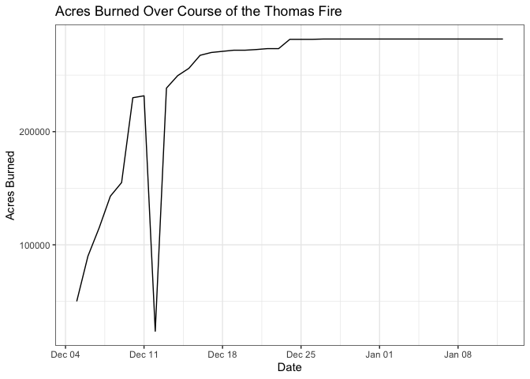

Thomas\_Fire\_Progression
================
Tim Lamour
10/21/2020

# title

## title

### title

basic text.

*italicize* single asterisks

**bold** double asterisks

1.  make
2.  numbered
3.  lists

we can make:

  - unumbered
  - lists

(link here)(<https://google.com>)

\#Load Libraries

``` r
library(tidyverse)
```

    ## ── Attaching packages ────────────────────────────────────────────────────────────────────────── tidyverse 1.3.0 ──

    ## ✓ ggplot2 3.3.2     ✓ purrr   0.3.4
    ## ✓ tibble  3.0.3     ✓ dplyr   1.0.2
    ## ✓ tidyr   1.1.2     ✓ stringr 1.4.0
    ## ✓ readr   1.3.1     ✓ forcats 0.5.0

    ## ── Conflicts ───────────────────────────────────────────────────────────────────────────── tidyverse_conflicts() ──
    ## x dplyr::filter() masks stats::filter()
    ## x dplyr::lag()    masks stats::lag()

``` r
library(readxl)
library(lubridate)
```

    ## 
    ## Attaching package: 'lubridate'

    ## The following objects are masked from 'package:base':
    ## 
    ##     date, intersect, setdiff, union

``` r
library(RColorBrewer)
```

# Load data

``` r
socal.fire <- read_excel("~/Desktop/Github/144l_students/Input_Data/week1/Thomas_Fire_Progression.xlsx")
```

# Look at data

``` r
glimpse(socal.fire)
```

    ## Rows: 39
    ## Columns: 5
    ## $ Date         <dttm> 2017-12-05, 2017-12-06, 2017-12-07, 2017-12-08, 2017-12…
    ## $ Acres_Burned <dbl> 50000, 90000, 115000, 143000, 155000, 230000, 231700, 23…
    ## $ Containment  <dbl> 0, 5, 5, 10, 15, 10, 20, 25, 30, 35, 35, 40, 45, 50, 55,…
    ## $ PM10         <dbl> 68, 93, NA, 95, 109, 107, 141, 117, 100, 96, 82, 125, 97…
    ## $ PM25         <dbl> 149, 194, 281, 177, 172, 172, 169, 169, 164, 155, 148, 1…

# Make plot dataframe

``` r
plot.data <- socal.fire %>%
  rename(Acres = Acres_Burned, Containment = Containment)
```

``` r
glimpse(plot.data)
```

    ## Rows: 39
    ## Columns: 5
    ## $ Date        <dttm> 2017-12-05, 2017-12-06, 2017-12-07, 2017-12-08, 2017-12-…
    ## $ Acres       <dbl> 50000, 90000, 115000, 143000, 155000, 230000, 231700, 236…
    ## $ Containment <dbl> 0, 5, 5, 10, 15, 10, 20, 25, 30, 35, 35, 40, 45, 50, 55, …
    ## $ PM10        <dbl> 68, 93, NA, 95, 109, 107, 141, 117, 100, 96, 82, 125, 97,…
    ## $ PM25        <dbl> 149, 194, 281, 177, 172, 172, 169, 169, 164, 155, 148, 16…

``` r
options(scipen = 10000)
ggplot(plot.data, aes(x = Date, y = Acres)) +
  geom_line() +
  labs(x = "Date", y = "Acres Burned", title = "Acres Burned Over Course of the Thomas Fire") +
  theme_bw()
```

<!-- -->

# This plot shows the total number of acres burned over the course of the Thomas Fire. From the plot, you can tell that the fire grew very rapidly during the 1st week, but then started to become contained. Since the line is flat around December 23rd, you can tell that this is when the fire was on its way to being 100% contained. The sharp dip in the data on December 12th is due to an error in the provided datasheet, the value should be 236,000 instead of 23,600.
