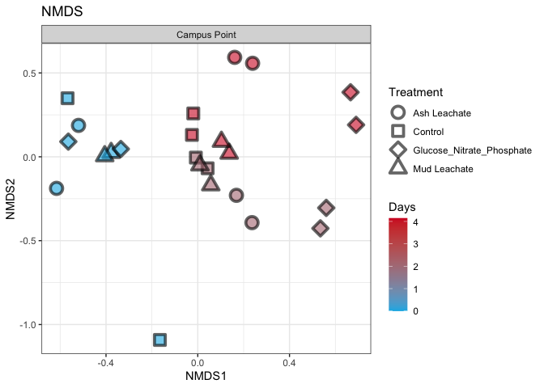

Untitled
================
Tim Lamour
11/22/2020

# Intro

Explore processed EEMB 144L 16s sequences using phyloseq

``` r
library(tidyverse)
```

    ## ── Attaching packages ─────────────────────────────────────── tidyverse 1.3.0 ──

    ## ✓ ggplot2 3.3.2     ✓ purrr   0.3.4
    ## ✓ tibble  3.0.4     ✓ dplyr   1.0.2
    ## ✓ tidyr   1.1.2     ✓ stringr 1.4.0
    ## ✓ readr   1.4.0     ✓ forcats 0.5.0

    ## ── Conflicts ────────────────────────────────────────── tidyverse_conflicts() ──
    ## x dplyr::filter() masks stats::filter()
    ## x dplyr::lag()    masks stats::lag()

``` r
library(phyloseq)
library(RColorBrewer)
```

# Import Data

``` r
count.tab <- read_rds("~/Desktop/Github/144l_students/Input_Data/week 6/seqtab-nochimtaxa.rds")
tax.tab <- read_rds("~/Desktop/Github/144l_students/Input_Data/week 6/taxa.rds")
sample.tab <- read_rds("~/Desktop/Github/144l_students/Output_data/Week 4/144L_processed_DOC_BGE.rds") %>%
  drop_na(DNA_SampleID) %>%
  column_to_rownames(var = "DNA_SampleID")
```

# Phyloseq Object

``` r
OTU = otu_table(count.tab, taxa_are_rows = TRUE)
TAX = tax_table(tax.tab)
SAM = sample_data(sample.tab)
ps = phyloseq(OTU,TAX,SAM)
```

# Filter Sequences

filter out chloroplassts and mitochondria since we only intended to
amplify bacterial sequences

``` r
sub_ps <- ps %>%
  subset_taxa(Family != "mitochondira" & Order != "Chloroplast")
```

# Sample Summary

As a first analysis, we will look at the distribution of read counts
from our samples

``` r
sample_sum_df <- data.frame(sum = sample_sums(sub_ps))
```

``` r
# mean, max and min of sample read counts 
summary(sample_sum_df)
```

    ##       sum       
    ##  Min.   : 2064  
    ##  1st Qu.:23420  
    ##  Median :28828  
    ##  Mean   :28797  
    ##  3rd Qu.:33570  
    ##  Max.   :53948

``` r
sub_ps <- ps %>%
  subset_taxa(Family != "mitochondira" & Order != "Chloroplast")
ggplot(sample_sum_df, aes(x = sum)) +
  geom_histogram(color = "black", fill = "#377EB8", binwidth = 5000) +
  ggtitle("Distribution of sample sequence depth") +
  xlab("Read counts") +
  theme(axis.title.y = element_blank()) +
  theme_bw()
```

<!-- -->

# Beta Diversity

beta diversity = patterns in community strucutre between samples

## Subsample

we will rarefy (random subsample with replacement) the read depth of the
samples first (scale to the smallest library size)

``` r
ps_min <- rarefy_even_depth(sub_ps, sample.size = min(sample_sums(sub_ps)))
```

    ## You set `rngseed` to FALSE. Make sure you've set & recorded
    ##  the random seed of your session for reproducibility.
    ## See `?set.seed`

    ## ...

    ## 124OTUs were removed because they are no longer 
    ## present in any sample after random subsampling

    ## ...

``` r
mean(sample_sums(sub_ps)) #28796.92
```

    ## [1] 28796.92

``` r
mean(sample_sums(ps_min)) #2064
```

    ## [1] 2064

## NMDS

Here we will look at non-metric multidimensional scaling (NMDS)
ordinations of our full community samples. For NMDS plots it’s important
to set a seed since the starting positions of samples in the algorithm
is random

``` r
set.seed(1)
# Ordinate
nmds <- ordinate(sub_ps, method = "NMDS", distance = "bray") # stress = 0.07
```

    ## Square root transformation
    ## Wisconsin double standardization
    ## Run 0 stress 0.07441113 
    ## Run 1 stress 0.1452201 
    ## Run 2 stress 0.1557762 
    ## Run 3 stress 0.07479229 
    ## ... Procrustes: rmse 0.005562519  max resid 0.02144909 
    ## Run 4 stress 0.08275593 
    ## Run 5 stress 0.07579966 
    ## Run 6 stress 0.07689296 
    ## Run 7 stress 0.1619977 
    ## Run 8 stress 0.07737203 
    ## Run 9 stress 0.1620098 
    ## Run 10 stress 0.1210192 
    ## Run 11 stress 0.1186694 
    ## Run 12 stress 0.07441082 
    ## ... New best solution
    ## ... Procrustes: rmse 0.0001743536  max resid 0.0006782784 
    ## ... Similar to previous best
    ## Run 13 stress 0.1210192 
    ## Run 14 stress 0.08452223 
    ## Run 15 stress 0.07689295 
    ## Run 16 stress 0.2409213 
    ## Run 17 stress 0.1750764 
    ## Run 18 stress 0.1572359 
    ## Run 19 stress 0.082762 
    ## Run 20 stress 0.07579978 
    ## *** Solution reached

``` r
set.seed(1)
# Ordinate 
nmds_min <- ordinate(ps_min, method = "NMDS", distance = "bray") # stress = 0.08
```

    ## Square root transformation
    ## Wisconsin double standardization
    ## Run 0 stress 0.09140828 
    ## Run 1 stress 0.1517714 
    ## Run 2 stress 0.09140927 
    ## ... Procrustes: rmse 0.000443022  max resid 0.001555655 
    ## ... Similar to previous best
    ## Run 3 stress 0.09140871 
    ## ... Procrustes: rmse 0.00032547  max resid 0.001139544 
    ## ... Similar to previous best
    ## Run 4 stress 0.09073386 
    ## ... New best solution
    ## ... Procrustes: rmse 0.02258251  max resid 0.09201593 
    ## Run 5 stress 0.1596527 
    ## Run 6 stress 0.09073386 
    ## ... New best solution
    ## ... Procrustes: rmse 1.824078e-05  max resid 4.46396e-05 
    ## ... Similar to previous best
    ## Run 7 stress 0.1775145 
    ## Run 8 stress 0.09073386 
    ## ... New best solution
    ## ... Procrustes: rmse 1.111493e-05  max resid 2.770812e-05 
    ## ... Similar to previous best
    ## Run 9 stress 0.1747778 
    ## Run 10 stress 0.1688083 
    ## Run 11 stress 0.13779 
    ## Run 12 stress 0.1083114 
    ## Run 13 stress 0.1720981 
    ## Run 14 stress 0.1714672 
    ## Run 15 stress 0.09083831 
    ## ... Procrustes: rmse 0.003866783  max resid 0.0137538 
    ## Run 16 stress 0.1920371 
    ## Run 17 stress 0.1605561 
    ## Run 18 stress 0.09140969 
    ## Run 19 stress 0.1083115 
    ## Run 20 stress 0.1083115 
    ## *** Solution reached

``` r
nmds.plot <- plot_ordination(sub_ps, nmds, title = "NMDS") +
  geom_point(aes(fill = days, shape = factor(Treatment)), alpha = 0.6, stroke = 2, size = 4) + 
  scale_shape_manual(values = c(21, 22, 23, 24)) +
  scale_fill_gradient(low = "#0db5e6", high = "#d31f2a") +
  theme_bw()


#removing one of the plotting layers (there are points within points)
nmds.plot$layers <- nmds.plot$layers[-1]
nmds.plot +
  facet_grid(~Location) +
  guides(fill = guide_colorbar(title = "Days"), shape = guide_legend(title = "Treatment"))
```

<!-- -->

``` r
nmds_min.plot <- plot_ordination(ps_min, nmds_min, title = "NMDS") +
  geom_point(aes(fill = days, shape = factor(Treatment)), alpha = 0.6, stroke = 2, size = 4) +
  scale_shape_manual(values = c(21, 22, 23, 24)) +
  scale_fill_gradient(low = "#0db5e6", high = "#d31f2a") +
  theme_bw()

nmds_min.plot$layers <- nmds_min.plot$layers[-1]
nmds_min.plot +
  facet_grid(~Location) +
  guides(fill = guide_colorbar(title = "Days"), shape = guide_legend(title = "Treatment"))
```

<!-- -->

# Alpha Diversity

we are going to calculate the Chao1 index for richness and the Shannon
diversity index. We will use the subsampled library, which retains
estimates of the species abundance of the real population while
standardizing sampling effort.

``` r
richness <- estimate_richness(ps_min, measures = c("Chao1", "Shannon")) %>%
  rownames_to_column(., var = "DNA_ID") %>%
  mutate_at(vars(DNA_ID), str_replace_all, pattern = "X144", "144")
```

let’s add the sample metadata into this dataframe

``` r
alphadiv <- left_join(richness, sample.tab %>%
  rownames_to_column(., var = "DNA_ID"))
```

    ## Joining, by = "DNA_ID"

``` r
library(ggpubr)
```

``` r
pivot.data <- alphadiv %>%
  select(Treatment, Location, Bottle, Timepoint, days, Chao1, Shannon) %>%
  pivot_longer(., cols = c(Chao1, Shannon), names_to = "measure", values_to = "est") %>%
  left_join(., alphadiv %>%
              select(Treatment, Location, Bottle, Timepoint, days, se.chao1)) %>%
  mutate(se.chao1 = ifelse(measure == "Chao1", se.chao1, NA))
```

    ## Joining, by = c("Treatment", "Location", "Bottle", "Timepoint", "days")

``` r
alpha.plot <- ggboxplot(pivot.data, x = "Timepoint", y = "est", 
                        xlab = expression(italic(paste(""))),
                        ylab = expression(italic(paste("Alpha Diversity Measure"))),
                        add = "dotplot", 
                        width = 0.2,
                        ggtheme = theme_bw()) +
  stat_compare_means(label.x = "6") +
  facet_grid(measure~ factor(Treatment), scales = "free")
```

## Generate relative abundances

``` r
ps_std <- transform_sample_counts(ps_min, function(x) x/sum(x))
ps_std.tab <- as(otu_table(ps_std), "matrix")
ps_std.df = as.data.frame(ps_std.tab)
```

## Make table

``` r
tax.df <- as.data.frame(tax.tab)
custom.tab <- tax.df %>%
  rownames_to_column(., var = "asv") %>%
  left_join(., ps_std.df %>% rownames_to_column(., var = "asv")) %>%
  mutate(pco = paste(Phylum, "_", Class, "_", Order)) %>%
  select(-c(asv:Genus)) %>% 
  select(pco,everything()) %>%
  group_by(pco) %>%
  summarise_at(vars(contains(c("144"))), sum, na.rm = T) %>% 
  ungroup()
```

    ## Joining, by = "asv"

``` r
#save the row names and then  make them into the column names 
colnames <- custom.tab[,1]
t_custom.tab <- as.data.frame(t(custom.tab[,-1]))
colnames(t_custom.tab) <- colnames$pco

#merge
sweet.tab <- t_custom.tab %>%
  rownames_to_column(., var = "sample") %>%
  left_join(., sample.tab %>% rownames_to_column(., var = "sample") %>% select(sample, Experiment, Location, Bottle, Treatment, Timepoint, days, cells)) %>%
  select(sample, Experiment:cells, everything())
```

    ## Joining, by = "sample"

``` r
relabund <- sweet.tab %>%
  select(-c(sample:cells)) %>%
  .[ , colSums(.) > 0] %>%
  .[, order(colSums(-.))] %>%
  bind_cols(sweet.tab %>% select(sample:cells), .)
```

## Heatmap

``` r
relaheat.data <- relabund %>%
  select(-c(sample, Experiment, Location, Bottle, days, cells)) %>%
           pivot_longer(.,-c(Treatment:Timepoint), names_to = "taxa", values_to = "relabund") %>%
           separate(taxa, into = c("p", "c", "o"), sep = "_")
```

    ## Warning: Expected 3 pieces. Additional pieces discarded in 48 rows [5, 36, 57,
    ## 88, 109, 140, 161, 192, 213, 244, 265, 296, 317, 348, 369, 400, 421, 452, 473,
    ## 504, ...].

``` r
library(viridis)
```

    ## Loading required package: viridisLite

``` r
relabund <- relaheat.data %>%
  ggplot(aes(x = Timepoint, y = o)) +
  geom_tile(aes(fill = relabund), color = "white") +
  scale_fill_viridis(option = "D") +
  labs(x = "", y = "Order", fill = "Relative Abundance") +
  facet_grid(~factor(Treatment)) +
  theme_bw() +
  theme(axis.text.y = element_text(size = 12),
        legend.position = "top") +
  guides(fill = guide_colourbar(barheight = 2, barwidth = 20, frame.colour = "black", frame.linewidth = 2, ticks.colour = "black", ticks.linewidth = 1), color = F)
```

# Save and knit

``` r
saveRDS(sweet.tab, "~/Desktop/Github/144l_students/Output_data/Week 6/Custom_ASV_Table.rds")

saveRDS(sub_ps, "~/Desktop/Github/144l_students/Output_data/Week 6/phyloseq_obj.rds")

saveRDS(ps_min, "~/Desktop/Github/144l_students/Output_data/Week 6/subsampled_phyloseq_obj.rds")

saveRDS(alphadiv, "~/Desktop/Github/144l_students/Output_data/Week 6/alphadiv.rds")
```
